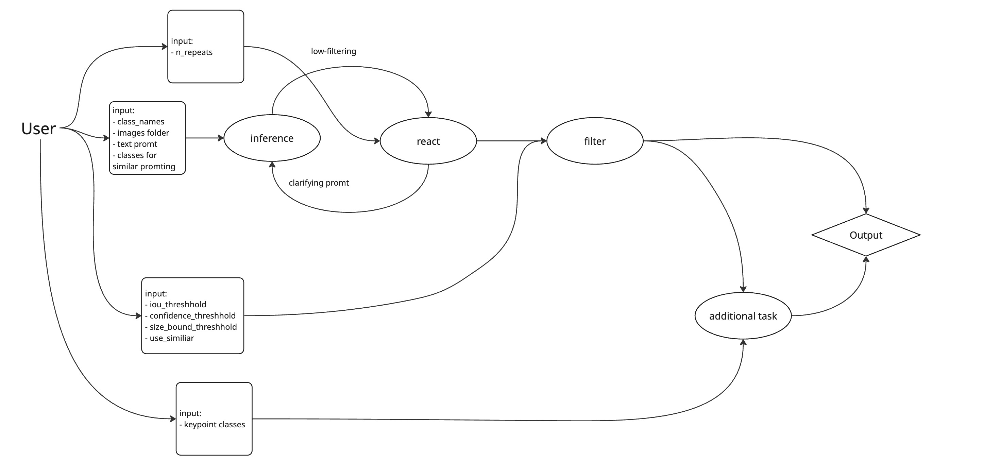
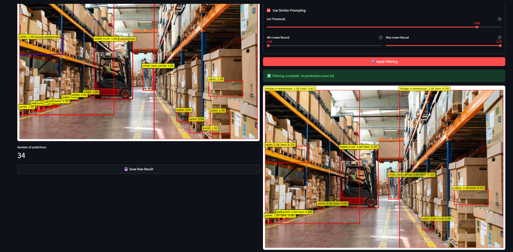
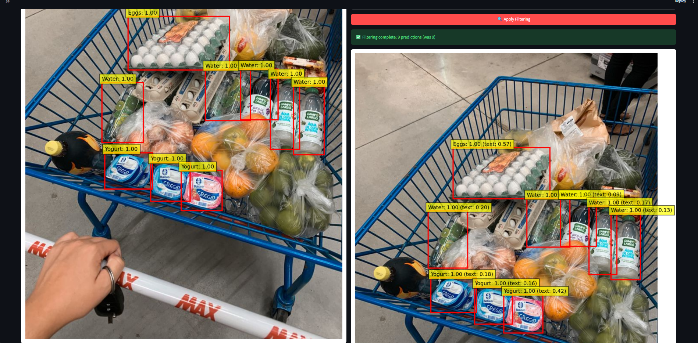
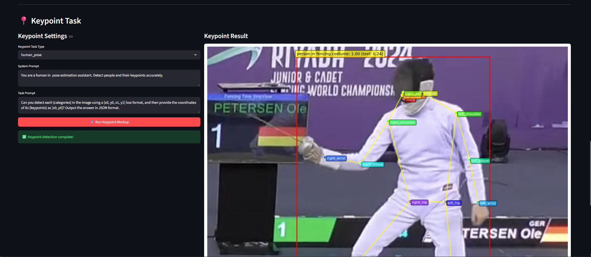
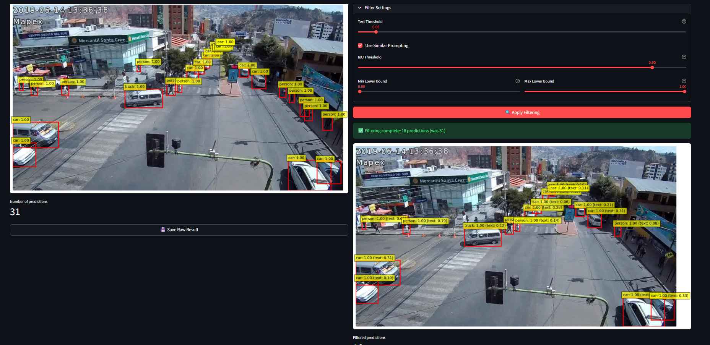
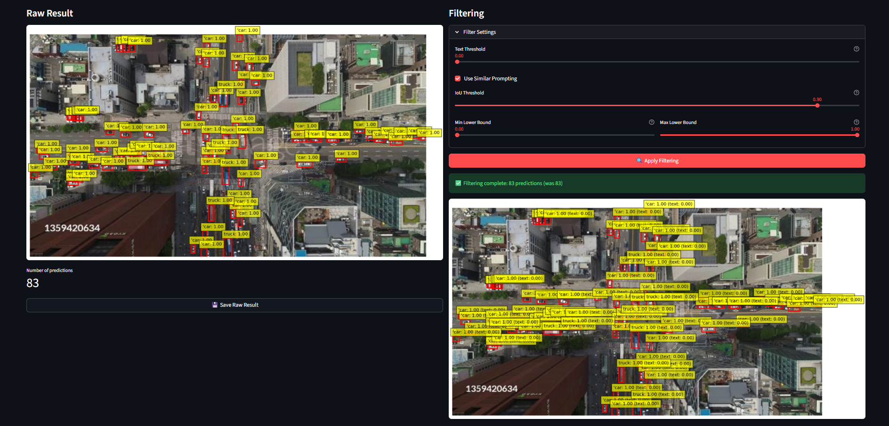

## Пример запуска

1. Устанавливаем зависимости

```sh
pip install -r requirements.txt
```

2. Запуск UI
```sh
streamlit run test_app.py
```

## Схема



## Примеры работы 

### Склад



### Тележка из магазина



### Точки фехтовальщика



### Уличная камера



### Камера дрона



## Эксперименты

([google-таблица](https://docs.google.com/spreadsheets/d/1-dlnk3lfv7v4nxOmM5kfMtUcvFE5Tyd9v6ZDt35DQLc/edit?gid=1311225532#gid=1311225532)

## Презентация 

([google-таблица](https://docs.google.com/presentation/d/1-DPKsnW0Eq-iTcLJ87VJdkM5R902oD8tMTEBItQEvgI/edit?usp=sharing)
